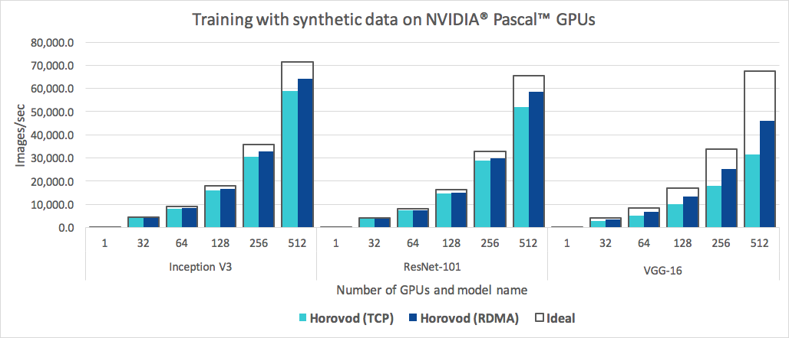
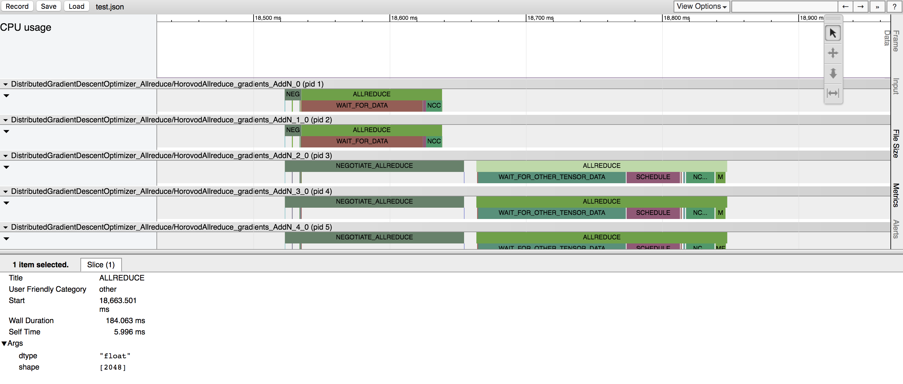

# Horovod

> **訳者注**
> この文書は [Horovod GitHub](https://github.com/horovod/horovod) トップの README.rst を、20201年10月7日に翻訳したものです。

<div align="right"></div>

Horovodは、TensorFlow、Keras、PyTorch、ApacheMXNet向けの分散型ディープラーニングトレーニングフレームワークです。
Horovodの目標は、分散型ディープラーニングを高速で使いやすくすることです。

<div align="left"></div>

Horovodは、[LF AI&Data Foundation](https://lfdl.io/)（LF AI＆Data）によってホストされています。
人工知能、機械学習、ディープラーニングでオープンソーステクノロジを使用することに熱心に取り組んでおり、これらのドメインのオープンソースプロジェクトのコミュニティをサポートしたい場合は、LF AI&DataFoundationへの参加を検討してください。
誰が関与し、Horovodがどのように役割を果たすかについての詳細は、Linux Foundation の [発表](https://lfdl.io/press/2018/12/13/lf-deep-learning-welcomes-horovod-distributed-training-framework-as-newest-project/) を参照してください。

## 目次

- [ドキュメント](#ドキュメント)
- [なぜ Horovod なのか？](#なぜHorovodなのか？)
- [インストール](#インストール)
- [コンセプト](#コンセプト)
- [サポートするフレームワーク](#サポートするフレームワーク)
- [使い方](#使い方)
- [Horovod の実行](#Horovodの実行)
- [Gloo](#Gloo)
- [mpi4py](#mpi4py)
- [推論](#推論)
- [Tensor Fusion](#TensorFusion)
- [Horovod タイムライン](#Horovodタイムライン)
- [自動パフォーマンスチューニング](#自動パフォーマンスチューニング)
- [Horovod プロセスセット](#Horovodプロセスセット)
- [ガイド](#ガイド)
- [トラブルシューティング](#トラブルシューティング)
- [引用](#引用)
- [出版物](#出版物)
- [リファレンス](#リファレンス)
- [コミュニティ参加](#コミュニティ参加)

## ドキュメント

- [最新リリース](https://horovod.readthedocs.io/en/stable)
- [マスタ](https://horovod.readthedocs.io/en/latest)

## なぜ Horovod なのか？

このプロジェクトの主な動機は、単一のGPUトレーニングスクリプトを簡単に取得し、それを正常にスケーリングして、多数のGPU間で並行してトレーニングできるようにすることです。
これには2つの側面があります。

1. プログラムを配布するには、プログラムにどの程度の変更を加える必要がありますか。また、プログラムの実行はどのくらい簡単ですか。
2. 分散モードで実行する速度はどれくらいですか？

Uberの内部では、MPIモデルがはるかに単純であり、パラメーターサーバを使用した分散TensorFlowなどのこれまでのソリューションよりもはるかに少ないコード変更で済むことがわかりました。
Horovodを使用して拡張用のトレーニングスクリプトを作成すると、コードをさらに変更することなく、単一のGPU、複数のGPU、または複数のホストで実行できます。
詳細については、[使い方](#使い方) セクションを参照してください。

使いやすさに加えて、Horovodは高速です。
以下は、RoCE対応の 25 Gbit/s ネットワークに接続された 4 つの Pascal GPU を備えた128台のサーバで実行されたベンチマークを表すグラフです。



Horovodは、Inception V3とResNet-101の両方で90％のスケーリング効率を達成し、VGG-16で68％のスケーリング効率を達成します。
これらの数値を再現する方法については、[ベンチマーク](https://github.com/horovod/horovod/blob/master/docs/benchmarks.rst) を参照してください。

MPIとNCCL自体のインストールは面倒に思えるかもしれませんが、インフラストラクチャを扱うチームが1回行うだけで済み、モデルを作成する社内の他の全員が、大規模なトレーニングのシンプルさを楽しむことができます。

## インストール

Horovodをインストールするには：

1. CMakeをインストールします。
2. PyPI から TensorFlow をインストールした場合は、`g++-5` 以上がインストールされていることを確認してください。PyPIからPyTorchをインストールした場合は、`g++-5` 以上がインストールされていることを確認してください。Condaからいずれかのパッケージをインストールした場合は、`gxx_linux-64` Condaパッケージがインストールされていることを確認してください。
3. `horovod` pip パッケージをインストールします。

CPUで実行するには：

```bash
$ pip install horovod
```

NCCLを使用してGPUで実行するには：

```bash
$ HOROVOD_GPU_OPERATIONS = NCCL pip install horovod
```

GPUのサポートとHorovodのインストールの詳細については、[GPUを使ったHorovod](https://github.com/horovod/horovod/blob/master/docs/gpus.rst) をお読みください。

Horovodのインストールオプションの完全なリストについては、[インストールガイド](https://github.com/horovod/horovod/blob/master/docs/install.rst) をお読みください。

MPIを使用する場合は、[MPIを使ったHorovod](https://github.com/horovod/horovod/blob/master/docs/mpi.rst) をお読みください。

Condaを使用する場合は、[HorovodのGPUサポートを使用したConda環境の構築](https://github.com/horovod/horovod/blob/master/docs/conda.rst) をお読みください。

Dockerを使用する場合は、[Docker内でHorovod](https://github.com/horovod/horovod/blob/master/docs/docker.rst) をお読みください。

ソースからHorovodをコンパイルするには、[コントリビュータガイド](https://github.com/horovod/horovod/blob/master/docs/contributors.rst) の指示に従ってください。

## コンセプト

Horovod の基本原則は、_サイズ_ 、 _ランク_ 、 _ローカルランク_ 、**allreduce** 、 **allgather** 、 **ブロードキャスト** 、そして **alltoall** のような [`MPI`](http://mpi-forum.org/) コンセプトに基づいています。
詳細は、[このページ](https://github.com/horovod/horovod/blob/master/docs/concepts.rst) を参照してください。

## サポートするフレームワーク

Horovodを使ったサンプルやベストプラクティスについては、次のページリンクを参照してください。

- [TensorFlow で Horovod](https://github.com/horovod/horovod/blob/master/docs/tensorflow.rst)
- [TensorFlow/XLA で Horovod](https://github.com/horovod/horovod/blob/master/xla.rst)
- [Keras で Horovod](https://github.com/horovod/horovod/blob/master/docs/keras.rst)
- [PyTorch で Horovod](https://github.com/horovod/horovod/blob/master/docs/pytorch.rst)
- [MXNet で Horovod](https://github.com/horovod/horovod/blob/master/docs/mxnet.rst)

## 使い方

Horovodを使用するには、プログラムに次の手順で追加を行います。

1. Horovodを初期化するために `hvd.init()` を実行します。
2. リソースの競合を回避するために、各GPUを単一のプロセスに固定します。
  プロセスごとに1つのGPUの一般的なセットアップでは、これをローカルランクに設定します。サーバ上の最初のプロセスには最初のGPUが割り当てられ、2番目のプロセスには2番目のGPUが割り当てられます。
3. ワーカ数によって学習率をスケーリングします。
  同期分散トレーニングの有効なバッチサイズは、ワーカ数によってスケーリングされます。学習率の増加は、バッチサイズの増加を補います。
4. `hvd.DistributedOptimizer` のオプティマイザをでラップします。
  分散オプティマイザは、勾配計算を元のオプティマイザに委任し、allreduceまたはallgatherを使用して勾配を平均し、それらの平均化された勾配を適用します。
5. 初期変数の状態をランク0から他のすべてのプロセスにブロードキャストします。
  これは、トレーニングがランダムな重みで開始されたとき、またはチェックポイントから復元されたときに、すべてのワーカの一貫した初期化を保証するために必要です。
6. コードを変更して、ワーカ0にのみチェックポイントを保存し、他のワーカがチェックポイントを破損しないようにします。

TensorFlow v1の使用例（完全なトレーニングサンプルについては、[examples](https://github.com/horovod/horovod/blob/master/examples/) ディレクトリを参照してください）：

```python
import tensorflow as tf
import horovod.tensorflow as hvd


# Horovod の初期化
hvd.init()

# ローカルランクの処理に使用されるGPUをピン付け（プロセスごとに1つのGPU）
config = tf.ConfigProto()
config.gpu_options.visible_device_list = str(hvd.local_rank())

# モデルのビルド...
loss = ...
opt = tf.train.AdagradOptimizer(0.01 * hvd.size())

# Horovod 分散オプティマイザを追加
opt = hvd.DistributedOptimizer(opt)

# 初期化中にランク0から他のすべてのプロセスに変数をブロードキャストするためのフックを追加
hooks = [hvd.BroadcastGlobalVariablesHook(0)]

# トレーニング操作を構築
train_op = opt.minimize(loss)

# Save checkpoints only on worker 0 to prevent other workers from corrupting them.
# 他のワーカがチェックポイントを破損しないように、ワーカ0のみでチェックポイントを保存
checkpoint_dir = '/tmp/train_logs' if hvd.rank() == 0 else None

# MonitoredTrainingSession は、セッションの初期化、チェックポイントからの復元、
# チェックポイントへの保存、完了またはエラーの発生時に閉じる処理を行う
with tf.train.MonitoredTrainingSession(checkpoint_dir=checkpoint_dir,
                                       config=config,
                                       hooks=hooks) as mon_sess:
  while not mon_sess.should_stop():
    # 同期トレーニングを実行する
    mon_sess.run(train_op)
```

## Horovod の実行

以下のコマンド例は、分散トレーニングを実行する方法を示しています。
RoCE/InfiniBand の調整やハングに対処するためのヒントなど、詳細については、[Horovod の実行](https://github.com/horovod/horovod/blob/master/docs/running.rst) を参照してください。

1. 4つのGPUを搭載したマシンで実行するには：

```bash
$ horovodrun -np 4 -H localhost:4 python train.py
```

2. 4つのGPUを備えた4台のマシンで実行するには：

```bash
$ horovodrun -np 16 -H server1:4,server2:4,server3:4,server4:4 python train.py
```

3. `horovodrun` ラッパなしで Open MPIを使用して実行するには（[OpenMPIを使用したHorovodの実行](https://github.com/horovod/horovod/blob/master/docs/mpi.rst) を参照のこと）。

4. Dockerで実行するには、[DockerでHorovod](https://github.com/horovod/horovod/blob/master/docs/docker.rst) を参照してください。

5. Kubernetesで実行するには、[Kubeflow MPIオペレータ](https://github.com/kubeflow/mpi-operator/) 、[Helm と Chart](https://github.com/kubernetes/charts/tree/master/stable/horovod/) 、 [FfDL](https://github.com/IBM/FfDL/tree/master/etc/examples/horovod/) 、および [Polyaxon](https://docs.polyaxon.com/integrations/horovod/) を参照してください。

6. Sparkで実行するには、[Spack で Horvod](https://github.com/horovod/horovod/blob/master/docs/spark.rst) を参照してください。

7. Rayで実行するには、[Ray で Horovod](https://github.com/horovod/horovod/blob/master/docs/ray.rst) を参照してください。

8. Singularity で実行するには、[Singularity](https://github.com/sylabs/examples/tree/master/machinelearning/horovod) を参照してください。

9. （例えばSummitのような）LSF HPCクラスタで実行するには、[LSF](https://github.com/horovod/horovod/blob/master/docs/lsf.rst) を参照してください。

10. Hadoop Yarn で実行するには、[TonY](https://github.com/linkedin/TonY/) を参照してください。

## Gloo

[Gloo](https://github.com/facebookincubator/gloo) は、Facebookによって開発されたオープンソースの集団コミュニケーションライブラリです。

Gloo は Horovod に含まれており、ユーザは MPI をインストールしなくても Horovod を実行できます。

MPI と Gloo の両方をサポートしている環境では、horovodrun引数 `^^gloo` を次のように渡すことで、実行時にGlooを使用することを選択できます：

```bash
$ horovodrun --gloo -np 2 python train.py
```

## mpi4py

Horovod は、MPI がマルチスレッドサポートで構築されている場合、Horovod コレクティブと [mpi4py](https://mpi4py.scipy.org/) などの他のMPIライブラリとの混合とマッチングをサポートします。

`hvd.mpi_threads_supported()` 関数をクエリすることで、MPI マルチスレッドのサポートを確認できます。

```python
import horovod.tensorflow as hvd

# Horovod の初期化
hvd.init()

# MPIマルチスレッドがサポートされていることを確認
assert hvd.mpi_threads_supported()

from mpi4py import MPI
assert hvd.size() == MPI.COMM_WORLD.Get_size()
```

mpi4py　サブコミュニケータを使用して Horovod を初期化することもできます。
その場合、各サブコミュニケータは独立した Horovod トレーニングを実行します。

```python
from mpi4py import MPI
import horovod.tensorflow as hvd

# COMM_WORLD をサブコミュニケータに分割
subcomm = MPI.COMM_WORLD.Split(color=MPI.COMM_WORLD.rank % 2,
                               key=MPI.COMM_WORLD.rank)

# Horovod の初期化
hvd.init(comm=subcomm)

print('COMM_WORLD rank: %d, Horovod rank: %d' % (MPI.COMM_WORLD.rank, hvd.rank()))
```

## 推論

モデルを推論用に最適化し、グラフから Horovod 操作を削除する方法については [こちら](https://github.com/horovod/horovod/blob/master/docs/inference.rst) をご覧ください。

## Tensor Fusion

Horovod のユニークな点の1つは、通信と計算をインターリーブする機能と、小さなallreduce操作をバッチ処理する機能を **組み合わせること** です。
これにより、パフォーマンスが向上します。
このバッチ機能を Tensor Fusion と呼びます。

詳細と調整手順については、[こちら](https://github.com/horovod/horovod/blob/master/docs/tensor-fusion.rst) をご覧ください。

## Horovod タイムライン

Horovodには、Horovodタイムラインと呼ばれるアクティビティのタイムラインを記録する機能があります。



Horovod タイムラインを使用して、Horovodのパフォーマンスを分析します。
詳細と使用方法については、[こちら](https://github.com/horovod/horovod/blob/master/docs/timeline.rst) をご覧ください。

## 自動パフォーマンスチューニング

Tensor Fusion やその他の高度な Horovod 機能を効率的に利用するために適切な値を選択するには、かなりの試行錯誤が必要になる可能性があります。
自動チューニングと呼ばれるこのパフォーマンス最適化プロセスを自動化するシステムを提供します。
この機能は、`horovodrun` への単一のコマンドライン引数で有効にできます。

詳細と使用方法については、[こちら](https://github.com/horovod/horovod/blob/master/docs/autotune.rst) をご覧ください。

## Horovod プロセスセット

Horovod を使用すると、1つの分散トレーニングに参加するプロセスのさまざまなグループで個別の集合操作を同時に実行できます。
この機能を利用するように `hvd.process_set` オブジェクトを設定します。

詳細な手順については、[プロセスセット](https://github.com/horovod/horovod/blob/master/docs/process_set.rst) を参照してください。

## ガイド

1. [BatchAI と Horovod](https://github.com/Azure/BatchAI/tree/master/recipes/Horovod) を Microsoft Azureで使用した分散トレーニングの実行
2. [Horovodを使用した分散モデルトレーニング](https://spell.ml/blog/distributed-model-training-using-horovod-XvqEGRUAACgAa5th)

このサイトで公開したいユーザーガイドへのリンクを送ってください

## トラブルシューティング

[トラブルシューティング](https://github.com/horovod/horovod/blob/master/docs/troubleshooting.rst) を参照して答えが見つからない場合は [チケット](https://github.com/horovod/horovod/issues/new) を送信してください。

## 引用

みなさんの研究に役立つのであれば、各自の出版物で Horovod を引用してください：

```bibtex
@article{sergeev2018horovod,
  Author = {Alexander Sergeev and Mike Del Balso},
  Journal = {arXiv preprint arXiv:1802.05799},
  Title = {Horovod: fast and easy distributed deep learning in {TensorFlow}},
  Year = {2018}
}
```

## 出版物

1. Sergeev, A., Del Balso, M. (2017) Meet Horovod: Uber’s Open Source Distributed Deep Learning Framework for TensorFlow. Retrieved from https://eng.uber.com/horovod/
2. Sergeev, A. (2017) Horovod - Distributed TensorFlow Made Easy. Retrieved from https://www.slideshare.net/AlexanderSergeev4/horovod-distributed-tensorflow-made-easy
3. Sergeev, A., Del Balso, M. (2018) Horovod: fast and easy distributed deep learning in TensorFlow. Retrieved from [arXiv:1802.05799](https://arxiv.org/abs/1802.05799)

## リファレンス

Horovod のソースコードは、AndrewGibianskyとJoelHestness によって作成されたBaidu [tensorflow-allreduce](https://github.com/baidu-research/tensorflow-allreduce) リポジトリに基づいています。
彼らのオリジナルの研究は、記事「HPCテクニックをディープラーニングに（[Bringing HPC Techniques to Deep Learning](http://andrew.gibiansky.com/blog/machine-learning/baidu-allreduce/)）」に記載されています 。

## コミュニティ参加

- コラボレーションとディスカッションのための [Slackコミュニティ](https://forms.gle/cPGvty5hp31tGfg79)
- [Horovod プロジェクトの最新情報](https://lists.lfai.foundation/g/horovod-announce)
- 討論のための[Horovod Technical-Discussion](https://lists.lfai.foundation/g/horovod-technical-discuss)
