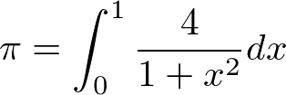

# πを計算するMPI版Cプログラムサンプル



上記の式を用いてπを計算するMPI版プログラムサンプル。

## コンパイル

- ログインノードにログイン
- 以下のコマンドを実行

```bash
make clean all
```

> クロスコンパイラにより計算ノード用バイナリが作成される。

## 実行

### 富岳計算ノード

- ログインノードにログイン
- 各自のアカウント情報に基づき、 `MPI_Pi.sh` の `rscunit` を変更

```bash
#PJM --rsc-list "rscunit=rscunit_ft01"
```

- ジョブ開始・終了時メールを送信したい場合 `MPI_Pi.sh` の以下の行を修正

```bash
#PJM --mail-list "hogehoge@fugafuga.slack.com"
```

- `pjsub ./MPI_Pi.sh` を実行

> 実行は富岳計算ノード（４ノード、各ノード４プロセス＝１６プロセス）で実行される。

## 注意

本コードは書籍「Raspberry Piでスーパーコンピュータを作ろう」より引用・修正したもの。
