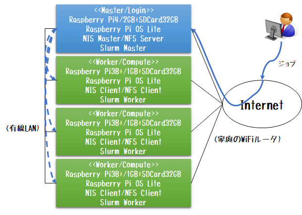

# 貧岳: Pugaku (Pi Cluster for Proletariat)

貧学 (pugaku: Pi Cluster for Proletariat) は、富岳上でテスト実行する前に事前に開発・テストするためのRaspberry Pi クラスタ環境です。

Spack 構築ベース環境やSlurmジョブスクリプトの開発・テストに活用可能です。

> 富岳は`pjsub`でジョブ実行する富士通社製ジョブ管理ソフトウェアにて管理しているが、Slurmバッチスクリプトは富岳環境のものに類似しているので、ある程度はテストに使用可能。

## 構成

- ログインノード/NFSサーバ/NISマスタ/Slurmマスタ/NTPクライアント
  - Raspberry Pi 4/2GB x 1
  - 32GB SD-Card x 1
  - AC アダプタ x 1
  - LAN ケーブル x 1

- 計算ノード/NFSクライアント/NISクライアント/Slurmワーカ/NTPクライアント
  - Raspberry Pi 3B+/1GB x 3
  - 32GB SD-Card x 3
  - AC アダプタ x 3
  - LAN ケーブル x 3

- ネットワーク
  - 運用系(10.0.0.0/8)
    - 5ポートHUBを使った有線によるLAN接続
    - NFS/NIS/Slurm
  - サービス系(192.168.XX.0/24)
    - インターネットに接続可能なWiFiルータとの接続
    - apt/pip/ssh/scp/ntp

## インストール手順

1. [ログインノードインストール手順](./login_node.md)
2. [計算ノードインストール手順](./comp_node.md)

## FAQ

- `sinfo`しても計算ノードのSTATUSが`down`のままになる
  - 以下のいずれかをためしてください
    1. 該当計算ノードにて`sudo systemctl restart slurmd` を実行
    2. ログインノードにて`sudo scontrol update nodename=node0[2-4] state=resume` を実行
    3. ログインノードにて `sudo scontrol reconfigure` を実行

## 参考

- [Slurm チートシート](https://slurm.schedmd.com/pdfs/summary.pdf)
